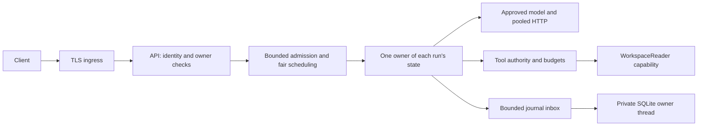

# Architecture

## Requirements that decide the shape

Kinesin is an execution runtime around a model. Its first complete release runs
several independent tasks for one owner. A later release exposes the same runtime
as an authenticated service for several owners.

| Goal | Concrete requirement |
|------|----------------------|
| Minimality | One controller process and a few explicit boundaries; no general workflow engine or distributed scheduler initially |
| Security | A model can propose work but cannot grant authority, choose credentials, change owners, or enlarge budgets |
| Low latency | Reuse connections; overlap independent I/O; avoid blocking runtime threads; measure queue and storage delay separately from inference |
| Scalability | Bound accepted runs, pending bytes, model calls, blocking work, storage traffic, and stream subscribers; reject overload predictably |

The runtime does not claim hostile native-code isolation, safe arbitrary plugins,
automatic task correctness, or transparent multi-controller execution. The
[security](security.md) and [performance](performance.md) contracts say what the
initial boundaries do guarantee and how to test them.

## Learn synchronously; execute I/O asynchronously

Start with ordinary owned Rust values and a pure decision function. Then add one
Tokio runtime when HTTP begins. Do not finish a blocking network client only to
replace it for the concurrency requirement.

Each run still follows sequential control flow. Several runners await I/O
concurrently. Async creates opportunities to overlap waiting; it does not create
more inference capacity. Reqwest supplies a reusable connection pool.
[Tokio introduction](https://tokio.rs/tokio/tutorial),
[reqwest Client](https://docs.rs/reqwest/latest/reqwest/struct.Client.html)

## Ownership map

| Owner | State it owns | Boundary it exposes |
|-------|---------------|--------------------|
| Deployment configuration | Approved workspace/model aliases, limits, storage/capture policy | Validated settings, without serializable credentials |
| Scheduler | Accepted queues, active runners, per-owner accounting | Admit, dispatch, cancel, drain |
| Run runner | Conversation, counters, phase, authority snapshot, cancellation token | One isolated execution |
| K-Core | Pure state and transition rules | Event in; next state and proposed effect out |
| Koil | Provider serialization, pooled client, response/stream decoding | Prepare exact request; async send; normalize result |
| WorkspaceReader | Open directory capability and read/list/search policy | Three bounded operations |
| Runner / pure checker | Frozen task contract, bounded observed evidence, acceptance receipt | Candidate assessment without I/O or new authority |
| Storage worker | SQLite connection and transactions | Bounded commands and commit acknowledgements |
| API | Verified principal and public request/response types | Owner-scoped submission, status, events, cancel, export |
| Kineserve | Optional directly spawned child | Readiness and owned-child cleanup |

There is no global “current conversation” or “current directory.” An owned
`RunAuthority` describes one admitted run's principal, workspace capability,
allowed tools, model profile, budgets, capture policy, and policy version.
It also freezes the selected task contract and checker/specification versions.
Secrets are separate handles at trusted boundaries.

K-Core does not perform I/O, read a clock, acquire a semaphore, or inspect a
credential. The runner observes the world and supplies typed events to it.

## The model boundary

Begin with a concrete `ModelClient` enum containing `Scripted` and `Http`
variants. Give both the same preparation and async-call behavior. This avoids
needing dynamic async trait objects as an early Rust lesson. Extract a trait when
another consumer actually needs one.

Preparation is pure: domain conversation plus the tested profile becomes
`PreparedRequest` containing a fixed destination identity, serialized bytes, and
a reproducible fingerprint. Sending never silently reserializes a different body.
The core sees normalized replies, not reqwest types or provider-specific markup.

For replay capture, store initial inputs and normalized observations once, then
record the prepared-request fingerprint and input sequence references. Rebuild
and compare the prepared request during replay. Do not persist the whole growing
conversation again on every turn. [Traces](traces.md) defines this contract.

## Context selection

Before implementing that effect, make context assembly explicit. Keep a small
ordered input inventory beside the conversation: source ID, semantic purpose,
origin/trust class, byte count, and revision or content fingerprint where known.
The initial inputs are installed instruction text and either a freeform user
request or the selected checked task's generated instruction; later
entries identify correlated tool observations. This can be concrete owned values
in the existing modules, without a new context service or generic registry.

Semantic purpose and authority are separate. A reference document can contain
instructions while remaining untrusted data. Directory names, model-generated
plans, and files named `CONTEXT.md` cannot grant tools or become installed policy.
Freeze initial configured inputs at acceptance. Tool observations capture the
bytes actually read when the tool runs; the workspace itself is not a filesystem
snapshot. Keep all selected bytes within existing history/request/queue budgets.

Readable task recipes can describe inputs, work, and expected outputs, with a
human review between separate runs. Their folder layout never replaces the
scheduler or journal. A future bounded loader must use explicit operator-selected
sources and preserve these rules. The [paper review](paper-review.md) explains
the evidence and the experiment to try before adding that loader.

## One model effect

1. The core proposes a model call.
2. The runner checks authority and per-run budgets and prepares a bounded body.
3. It waits for model capacity within the remaining run deadline and model-queue
   timeout. In shared service, the dispatch policy also applies owner fairness.
4. It asks the storage worker to commit `model_planned`, then awaits the
   acknowledgement. Nothing has been sent yet.
5. It rechecks cancellation and time after both waits. If sending is disallowed,
   it resolves that planned effect as unsent and stops.
6. It sends those prepared bytes using the approved client, with bounded reads,
   no automatic retry, and a deadline no longer than the remaining run time.
7. It commits the normalized result/error and releases client-owned capacity
   after the actual HTTP/stream operation ends.
8. It feeds the observation to the core, or records cancellation without starting
   another effect.

A client-side permit counts client-owned operations. Dropping a request does not
prove that remote generation stopped. The server owns actual inference slots.
Test disconnect behavior; do not report client cancellation as confirmed remote
termination.

## One tool effect

The model returns proposals. First validate batch structure and remaining
budgets. Then validate each call against the fixed allow-list and its typed
argument policy. Record a planned/finished pair even for denied calls; no handler
runs for a denial.

For allowed file tools, acquire a blocking-work permit **before** submitting work
to the blocking pool. The actual closure owns the permit until it exits. It uses
its `WorkspaceReader`, checks the opened handle's type, and produces a bounded
observation. Do not call ambient `std::fs::read` on a model-selected path.

Cancellation stops new dispatch. An already started blocking job remains owned
and consumes its permit until completion; a detached timeout must not pretend
that capacity is free. Cancellation observed before terminal-command submission
prevents an accepted result; an already submitted transaction must settle.
[Rust capability filesystem](https://github.com/bytecodealliance/cap-std),
[Tokio blocking-task limits](https://docs.rs/tokio/latest/tokio/task/fn.spawn_blocking.html)

## Persistence and observability

A complete model answer is a candidate. Release its model capacity, retain the
active runner, and apply the frozen bounded checker before finalization. The
first checker independently compares configured fields with actual complete
file observations. Freeform work remains unchecked. `completed` describes
execution; only `completed` plus acceptance `passed` means `task_accepted`.
No additional worker pool, model judge, repair loop, or generic validation
framework is needed. [Task acceptance](verification.md) specifies the narrow
contract, evidence limits, strict CLI exits, and cancellation arbitration.

Use SQLite through `rusqlite`. One dedicated OS thread owns the connection.
Async runners send bounded commands and receive transaction acknowledgements.
The terminal event, candidate/result, and acceptance receipt share a transaction.
No status reader or SSE subscriber can see acceptance before that commit.

Use WAL and `synchronous=FULL` as the initial durability contract; do not make a
latency graph look better by silently relaxing it. The writer can later commit
several ready commands together under explicit count/byte bounds. Acknowledgements
come after commit. SQLite is a one-host store with one writer at a time, not a
distributed database.
[SQLite WAL](https://www.sqlite.org/wal.html),
[SQLite synchronous setting](https://www.sqlite.org/pragma.html#pragma_synchronous)

Three outputs have different jobs:

- Operational telemetry: low-cardinality durations/counts and redacted failures.
- Run journal: lifecycle, policy, attempts, outcomes, and status.
- Replay capture: explicitly retained prompts and normalized model/tool data.

A bounded final candidate, including a rejected one, is retained as the owner's result even in metadata
capture mode. Metadata mode therefore does not mean “no sensitive content.”
Keep all state outside tool-visible roots and apply access/retention policy.

## Concurrent local release

Run a bounded batch of independent jobs. Bound the batch reader before creating
all jobs in memory. The scheduler owns at most the configured queued jobs and
active runners; it never spawns an unlimited number of semaphore waiters.

An active runner can wait for a model permit while another uses a file tool.
Release model capacity during tool work. Keep tools serial within one run first.
All permit waits consume that run's budget.

A “multi-agent” batch means independent runs with separate authority. Model-spawned
child agents are a later feature: they need bounded fan-out, inherited/reduced
authority, shared parent budgets, cancellation propagation, and explicit rules
about which information can flow between children.

## Shared-service release

Use the same scheduler and runner behind Axum. The first service supports trusted
compiled read-only tools and several authenticated owners on one controller host.

Each request selects permitted aliases; checked task selections bind a fixed
goal and workspace, while freeform submissions remain unchecked. Task permission
also requires permission for its actual workspace, tools, and selected model.
The request does not supply an authoritative owner,
filesystem root, model URL, API key, or unrestricted tool list. Authentication
establishes identity. Authorization checks that identity against each resource.
Per-owner quotas and model dispatch fairness supplement global limits.

Initially use operator-provisioned high-entropy bearer credentials over TLS with
explicit verification in the application. Do not invent a login, password store,
or OAuth server. Add an established identity provider when that requirement
appears. See [security](security.md) for credential and endpoint contracts.

The public API is in [loop-and-tools.md](loop-and-tools.md). A unique
`(owner_id, idempotency_key)` record with the normalized submission fingerprint
prevents a retried submission from creating two runs. It does not make external
tools execute exactly once.

Look up authorized retries before reserving new run capacity, retaining a
transactional race check for new submissions. Before acceptance can commit,
the controller owns settling and dispatching that submission independently of
the HTTP handler. Losing the response cannot abandon the accepted work.

On controller restart, unfinished runs become interrupted. Do not silently rerun
a model request or tool. Return persisted final results for completed runs.
Startup recovery is not resumable execution.

## Deployment and growth

The model can move to a larger machine through an approved private route, including
OS-managed WireGuard. The HTTP adapter does not require a second application
gateway. File tools stay where the runner executes; model-bound context travels
to the selected inference host.

Start native Windows or all-WSL, keeping the OS boundary simple. Choose a concrete
OS for shared-service deployment and verify its ACLs, process hardening, backups,
and network restrictions. A process Job Object, capability wrapper, and TLS tunnel
solve different problems.

Scale inference separately from the controller. A model-profile pool can later
route to several compatible inference replicas while each run retains its chosen
profile identity. Never silently fail over across different model/template/policy
settings in the middle of a run.

Multiple controller hosts are a new consistency boundary. They require a shared
transactional store, distributed admission, durable work ownership, leases/fencing,
and pending-effect reconciliation. Do not share a SQLite WAL file over a network
filesystem. Add that architecture after one controller's measured limits justify
it; [performance](performance.md) defines the evidence to collect.
