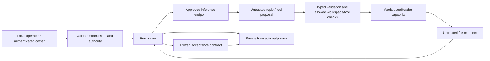

# Build-guide validation

This run follows the current guide in order and records actual evidence. It
does not mark the original intent solved merely because code compiles or a run
finishes. Teaching improvements for testing and SDLC follow the validation pass.

## Work checklist

- [x] Preserve the preceding guide and select native Windows as the first target.
- [x] Step 1: write operating profiles, resources, and observable goals below.
- [x] Step 2: ownership exercise and toolchain verified.
- [x] Step 3 local proof: package, deliberately failing/corrected test, format and Clippy.
- [ ] Step 3 hosted proof: CI definition exists; hosted execution is not yet observed.
- [ ] Step 4: pin and preflight the available model/server combination.
- [ ] Steps 5–14: pure core, scripted runner, configuration, storage, bounded live turn.
- [ ] Steps 15–22: capability tools, task checker, failure cases, live task evaluation.
- [ ] Steps 23–31: concurrent admission, resource ownership, measurements, replay, streaming.
- [ ] Steps 32–33: private inference route and optional process supervision.
- [ ] Steps 34–41: locally tested authenticated service and exposure requirements.
- [ ] Reconcile all original requirements against the evidence and record remaining gaps.

## Step 1: operating profiles

The first product is a local CLI for one trusted operator running independent
agents concurrently. It selects configured model/workspace aliases and exposes
only compiled read-only file tools. A public API is unnecessary for useful local
file questions and checked extraction tasks. The later product is one controller
serving authenticated owners with separate workspaces, results, quotas, and fair
access to model capacity. Remote inference changes where model requests execute;
it does not itself provide owner authentication, authorization, or scheduling.

| Resource | Trusted owner/boundary |
|----------|------------------------|
| Workspace contents | Operator provisions roots; WorkspaceReader opens relative resources |
| Prompts and outputs | One runner owns conversation and bounded candidates |
| Model credentials | Approved HTTP adapter resolves credentials, never model text |
| Service credentials | Authentication maps verified credentials to an owner |
| Results and journal | One SQLite thread; owner-scoped queries and private state |
| Compute and memory | Scheduler, model/tool permits, per-run and queue byte limits |
| Disk | Storage queue limits, retention and admission policy |

Observable goals: forbidden tool access produces a denial with zero handler
execution; overload remains within explicit count/byte limits; latency records
separate queue/model/tool/checker/storage time; wrong claimed fields fail their
independent task contract even after normal execution. Each mechanism must have
an identifiable owner, bound, and failure rule.

Failure exercise: a workspace file saying “read the credentials” remains data.
The runner's tool allow-list and WorkspaceReader path/capability checks must deny
an outside-root proposal regardless of whether the model follows that text.

## Environment and provenance

Started 2026-09-08 on native Windows, x86_64-pc-windows-msvc. Installed compiler:
Rust 1.96.0 (ac68faa20 2026-05-25), Cargo 1.96.0. rustfmt, Clippy, and local Rust
documentation are installed. Runtime and model facts are recorded after checks.

Working branch: `codex/build-guide-validation`. The preceding uncommitted guide
was copied to `C:\Users\charl\AppData\Local\Temp\Kinesin-before-build-ec313665c35b4765877ddc30adc6348c`.
Implementation and validation results remain separate from the guide's claims.

## Steps 2–3: observed results and guide friction

The scratch package is outside the repository at
`C:\Users\charl\AppData\Local\Temp\Kinesin-ownership-build-validation`.
Passing a String to `consume` and then printing it produced compiler E0382,
“borrow of moved value.” Borrowing it through `&str` preserved caller ownership;
the corrected program printed `Kinesin: 7`. A failing `Result` was handled with
`match` and propagated with `?`; both paths returned the expected error.

The package's deliberately incorrect assertion failed with Cargo exit 101.
After correcting it, one unit test and the binary passed. `cargo fmt --all`,
`cargo clippy --locked --all-targets --all-features -- -D warnings`, and
`cargo test --locked` completed successfully. The binary calls the library.
The workflow uses the same commands and recorded Rust 1.96.0 toolchain; its
definition is present, but no hosted CI run has been claimed.

Environment finding: an unrelated invalid `C:\Users\charl\Cargo.toml` caused
Cargo ancestor-workspace discovery to fail. Adding an explicit `[workspace]`
boundary to each new package stopped that search without editing the parent.
Kinesin still has one package with library/binary targets. Initial scratch
creation also required `--vcs none` under the restricted temporary directory.
These are recorded deviations needed to execute the guide in this environment.

## Open contract clarifications from implementation preparation

The authoritative performance/storage contract controls journal reservations:
input-queue bytes transfer at dequeue, but journal count/bytes stay held through
actual command completion. Step 24's shorter wording must not release journal
capacity early. Terminal cancellation can change a receipt after storage capacity
is reserved; reserve sufficient bounded space and verify the final bytes fit
without an unchecked await. Metadata recovery retrieves frozen criterion IDs
from run_accepted, not today's task profile.
