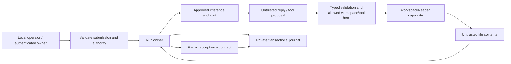

# Build-guide validation

This run follows the current guide in order and records actual evidence. It
does not mark the original intent solved merely because code compiles or a run
finishes. Teaching improvements for testing and SDLC follow the validation pass.

## Work checklist

- [x] Preserve the preceding guide and select native Windows as the first target.
- [x] Step 1: write operating profiles, resources, and observable goals below.
- [x] Step 2: ownership exercise and toolchain verified.
- [x] Step 3 local proof: package, deliberately failing/corrected test, format and Clippy.
- [ ] Step 3 hosted proof: CI definition exists; hosted execution is not yet observed.
- [x] Step 4: pin and preflight the available model/server combination.
- [x] Steps 5–8: owned pure core, async exercise, scripted runner and failure proofs.
- [x] Steps 9–14: validated authority, transactional storage, bounded live turn and cancellation.
- [ ] Steps 15–22: core proofs pass; remaining filesystem-race and controlled context/layout exercises are being reconciled.
- [ ] Steps 23–31: concurrent admission, resource ownership, measurements, replay, streaming.
- [x] Steps 32–33: record not applicable for the selected local attach profile.
- [x] Steps 34–40 local proofs: authenticated API, fairness, recovery and operations.
- [ ] Step 38 deployment identity/egress and step 41 shared-service exposure gate.
- [ ] Reconcile all original requirements against the evidence and record remaining gaps.

## Step 1: operating profiles

The first product is a local CLI for one trusted operator running independent
agents concurrently. It selects configured model/workspace aliases and exposes
only compiled read-only file tools. A public API is unnecessary for useful local
file questions and checked extraction tasks. The later product is one controller
serving authenticated owners with separate workspaces, results, quotas, and fair
access to model capacity. Remote inference changes where model requests execute;
it does not itself provide owner authentication, authorization, or scheduling.

| Resource | Trusted owner/boundary |
|----------|------------------------|
| Workspace contents | Operator provisions roots; WorkspaceReader opens relative resources |
| Prompts and outputs | One runner owns conversation and bounded candidates |
| Model endpoint | This profile uses an unauthenticated loopback endpoint; model credentials are not implemented |
| Service credentials | Authentication maps verified credentials to an owner |
| Results and journal | One SQLite thread; owner-scoped queries and private state |
| Compute and memory | Scheduler, model/tool permits, per-run and queue byte limits |
| Disk | Storage queue limits, retention and admission policy |

Observable goals: forbidden tool access produces a denial with zero handler
execution; overload remains within explicit count/byte limits; latency records
separate queue/model/tool/checker/storage time; wrong claimed fields fail their
independent task contract even after normal execution. Each mechanism must have
an identifiable owner, bound, and failure rule.

Failure exercise: a workspace file saying “read the credentials” remains data.
The runner's tool allow-list and WorkspaceReader path/capability checks must deny
an outside-root proposal regardless of whether the model follows that text.

## Environment and provenance

Started 2026-09-08 on native Windows, x86_64-pc-windows-msvc. Installed compiler:
Rust 1.96.0 (ac68faa20 2026-05-25), Cargo 1.96.0. rustfmt, Clippy, and local Rust
documentation are installed. Runtime and model facts are recorded after checks.

Working branch: `answer-key`, renamed from `codex/build-guide-validation` at the
user's request. Git branch names cannot contain spaces. The preceding uncommitted guide
was copied to `C:\Users\charl\AppData\Local\Temp\Kinesin-before-build-ec313665c35b4765877ddc30adc6348c`.
Implementation and validation results remain separate from the guide's claims.

## Steps 2–3: observed results and guide friction

The scratch package is outside the repository at
`C:\Users\charl\AppData\Local\Temp\Kinesin-ownership-build-validation`.
Passing a String to `consume` and then printing it produced compiler E0382,
“borrow of moved value.” Borrowing it through `&str` preserved caller ownership;
the corrected program printed `Kinesin: 7`. A failing `Result` was handled with
`match` and propagated with `?`; both paths returned the expected error.

The package's deliberately incorrect assertion failed with Cargo exit 101.
After correcting it, one unit test and the binary passed. `cargo fmt --all`,
`cargo clippy --locked --all-targets --all-features -- -D warnings`, and
`cargo test --locked` completed successfully. The binary calls the library.
The workflow uses the same commands and recorded Rust 1.96.0 toolchain.
The same format/Clippy/test commands also passed from a clean local clone of
checkpoint `17439a2`; this checks clean-checkout reproducibility, not hosted CI.

The implementation checkpoint `e346207` also passed formatting, all-target
Clippy and 164 offline tests from a clean local clone, with no copied runtime
state, workspace or model. The dependency build cache was reused. See
[clean-clone evidence](evidence/checks/clean-clone.txt).

Its first [hosted CI run](https://github.com/crussella0129/Kinesin/actions/runs/34196726263)
passed formatting and Clippy but exposed an SSE observer-expiry race. When a
historical event and the lifetime timer were both ready, unbiased selection
could emit the event instead of the explicit expiry frame. Local success was
insufficient evidence for that boundary. The correction prioritizes stopping,
checks before fetching and again before emission, and keeps the expiry assertion.

Environment finding: an unrelated invalid `C:\Users\charl\Cargo.toml` caused
Cargo ancestor-workspace discovery to fail. Adding an explicit `[workspace]`
boundary to each new package stopped that search without editing the parent.
Kinesin still has one package with library/binary targets. Initial scratch
creation also required `--vcs none` under the restricted temporary directory.
These are recorded deviations needed to execute the guide in this environment.

## Steps 5–8: pure decisions and async shell

Twelve core tests passed for initial ownership, roles/order, invalid transitions,
empty/failed/incomplete observations, disabled and malformed tools, whole-batch
correlation, terminal immutability, and execution/acceptance consistency.
Candidates remain running until durable finalization is reflected.

The scratch timing exercise observed sequential waits 182 ms versus overlapping
waits 91 ms. On its single runtime thread, a 10 ms timer took 80 ms with a blocking
sleep and 11 ms with an asynchronous sleep. These illustrate that setup only;
they are not harness latency benchmarks. Both task handles were joined.

The integrated checkpoint passed 18 tests and Clippy: the scripted client saw
the exact prepared bytes, one reply made one attempt, exhausted scripts and
model errors did not retry, and another task progressed during a delayed model.
Serde request serialization was introduced alongside step 8's prepared-byte
proof, immediately before its configuration use in step 9; SHA-256 was added
for the upcoming persisted fingerprints. These dependencies avoid a temporary
handwritten format. Only explicitly scripted clients can use the unpersisted
exercise path; live execution requires the journal composition.

## Steps 4 and 9–14: durable live execution

The selected model is the existing Qwen2.5-Coder 7B Q4_K_M file. Its checksum,
official source, tested server builds, template, GPU allocation, launch arguments,
and positive/negative wire fixtures are recorded in [model preflight](model-preflight.md).
The additional `Y:\Models\gguf` location was not visible in this execution context.
The first 27B suggestion was superseded by the user's 7B model selection.

Configuration/authority tests cover unknown and duplicate fields, disjoint
submission modes, frozen inputs, lowered limits, and owner/resource intersection.
Sixteen storage tests cover transaction rollback, intent ordering, terminal
immutability, owner filtering, idempotency, recovery, and bounded writer ownership.
Five HTTP protocol tests cover exact prepared bytes, typed finish validation,
redirect denial, oversized chunked error bodies, and encoding/destination checks.

The live Rust CLI returned a greeting with `completed/unchecked`; its default
process exit was 3. Explicit `--allow-unchecked` returned 0 without changing that
acceptance status. Nine runner integration tests passed through actual SQLite:
no admission or failed intent means no model effect; cancellation and deadline
stop new work while recording settlement; exact candidates and hashes survive
restart; replay records each observation once and metadata excludes private input.

## Steps 15–22: current integration evidence

Five file-capability tests passed, including a native Windows outside-root link
sentinel, bounded UTF-8 reads, and bounded listings. Eight pure checker tests
passed for exact field comparison, forged/wrong-source citations, strict answer
grammar, incomplete/conflicting/malformed sources, source revisions, and evidence
capacity. The integrated task evaluation is now recorded below.

The first live checked task, run `dc41fd73-f3c9-4b41-871f-4ec7e51101bd`, returned
fenced JSON with invented values and references, without a tool read. The harness
stored `completed/failed` and returned exit 2. A second configuration probe also
failed. This is preserved negative evidence, not discarded as a successful run.
A live freeform file question completed after an actual file tool round trip
(`63a90c07-f61f-4059-ac8d-a7d3631bd127`), reporting Rust, with unchecked acceptance.
The generated checked instruction was then clarified to separate the initial
tool call from the final answer format. The checker contract was not relaxed.

The fixed live evaluation then passed 12/12 satisfiable checked samples and
accepted 0/6 samples with missing, ambiguous, or truncated supporting sources.
Its original freeform cards met their stated rubrics in 10/14 samples. Both
missing-file recovery and two-file comparison failed twice despite completed
execution; four separate explicit-action diagnostics succeeded. These results
and the original failures are retained in [live evaluation](live-evaluation.md).
They establish a bounded extraction contract and demonstrate prompt-sensitive
agent behavior; they do not establish general problem-solving correctness.

## Steps 23–31: concurrent local execution

The controller owns admitted work after a caller disconnects, bounds active and
queued counts and bytes, and shares actual model and blocking-tool capacity.
Profiles with the same normalized origin share configured request permits;
different origins naming the same physical backend remain an operator constraint.
Cancelling local HTTP ownership does not prove remote compute has stopped. Service scheduling
rotates eligible owners both at run dispatch and at actual model-capacity grant.
The batch integration test runs six checked tasks through a real loopback HTTP
fixture, capability reads and SQLite with one active and one queued slot.
All six receipts pass without loading or spawning the whole batch at once.

Stream tests exercise fragmented SSE, partial tool arguments, usage-only chunks,
premature EOF, oversized data, slow display consumers, reconnect cursors and
terminal receipt delivery. A separate CLI process displays provisional text
before the provider finishes. Tool dispatch waits for a complete validated call.
Public service frames expose the committed receipt only on terminal events.

Replay capture version 2 records actual pre-dispatch and pre-terminal-arbitration
control observations. Pure replay now checks cancellation, execution deadlines,
model queue stops, journal admission stops, known-unsent intents, partial tool
batches, counters and the recomputed receipt. It rejects shifted or missing
timing controls and older captures that never recorded them. A late commit is
distinguished from its earlier recorded arbitration. Interrupted crash recovery
remains unavailable because the missing external observations are unknowable.
Separate-process replay tests work after the workspace, configuration and
database have been moved away; replay performs no model or file-tool effect.

The independent runtime review reproduced three failures after the happy path
worked: an inbox wait expiring at the run deadline lost finalization; a configured
response could exceed the retained-candidate ceiling; and an undersized inbox
could admit a run but never reserve its terminal command. Regression tests now
pass. Configuration enforces compatible bounds, while an already-admitted owner
keeps the same reservation future through cancellation and its one-time grace.
If settlement outlasts that grace, the controller reports unresolved ownership
and retains it until the operation actually settles; it never resumes effects.

The full-suite run also exposed a Windows-only fixture mistake: an accepted
socket inherited its nonblocking listener mode, making a blocking HTTP read fail
with `WouldBlock` when bytes had not arrived yet. The synthetic provider now
explicitly selects blocking mode with its bounded read timeout. This fixes the
fixture's synchronization instead of weakening the six-task acceptance assertion.

Measurements, raw samples, environmental interference and target comparisons
are kept in [performance baseline](performance-baseline.md). The original
1,000-sample p95 of 76.612 ms missed the proposed 50 ms overhead goal; that
negative result remains evidence even when later measurements improve.

The quiet checkpoint soak completed 10,152 synthetic runs in 600.463 seconds.
All 423 excess submissions were rejected; observed peaks stayed at eight active
and sixteen queued runs. Shutdown returned all controller and storage
reservations with zero runner errors. The two preceding warm repeats measured
p95 20.226 ms and 60.365 ms, so the 50 ms goal was not consistently met.
The zero-delay scripted provider still created a Tokio timer in those runs.
A separate correction removes that artificial wait when its configured delay is
zero, while preserving delayed scripts and the HTTP provider. A regression first
failed because the immediate fake required a timer runtime; it passes after the
correction. Repeated measurements must retain the older misses and identify
their own executable; the timer correction does not explain every source of
admission or journal variability.

## Steps 32–33: selected deployment profile

Inference runs on this machine through a loopback-only llama.cpp process.
There is no remote model host to provision or WireGuard route to verify.
Kinesin uses attach mode; the validation operator manually owns the model
process. Automatic model-process supervision remains optional and unimplemented.
Neither a remote-network proof nor managed-process cleanup is claimed.

## Steps 34–40: real private service and operator proofs

The service has bounded HTTP connections, headers, bodies, handler lifetimes,
observers and responses. Authentication precedes body parsing and protected
queries. Owner-scoped authorization covers create, list, fetch, cancel, export
and events. Integration tests cover cross-owner access, both overload scopes,
simultaneous idempotent submissions, dropped create responses, retries while
full, slow bodies/readers and persisted checked pass/fail receipt delivery.
Monitor failure closes readiness and admission in the integration tests; network readiness waits cancel,
and a blocking credential reload already started remains owned through completion.
The native Ctrl+C process test exposed an inherited Windows "ignore Ctrl+C"
attribute. A minimal Tokio-only program reproduced it. The service had remained
responsive; the first socket-inventory observation did not establish listener
closure. Registering the handler and explicitly restoring signal delivery fixed
the minimal reproduction and a real idle service process: ingress, monitor,
controller, writer and runtime settled, and the process exited in under a second.
Separate active service and CLI processes then received native Ctrl+C during a
real loopback HTTP exchange. Both persisted cancellation, closed the HTTP peer,
joined their owners and exited; the CLI emitted exit code 130. An isolated hidden
console regression reproduces the inherited-ignore launch condition. This avoids
treating an injected cancellation token as proof of native signal delivery.

`GET /health` is a bounded public process-liveness response. Authenticated
`GET /ready` remains separate: model or storage unavailability closes admission,
and invalid credentials do not prevent the process-liveness check from responding.

A fresh synthetic Windows state tree was created with a protected DACL at
creation, explicitly trusting charl, the current controller identity, SYSTEM
and Administrators. The production read-only private-state validator accepted
it. The prior broad development state remains unchanged and fails that audit.
See [native state audit](native-state-audit.md) for what this does and does not prove.

On the real loopback listener, owner Alice completed checked run
`881e493c-d3c5-40c0-8449-8afac765ebd0` after a real file read; its committed receipt
verified Kinesin/Rust. Bob received 404 for that run. Alice's identical key retry
returned the same run, and SSE caught up through its terminal receipt and closed.
An intentional process kill during a different running task produced
`interrupted/unchecked` after restart, with no re-execution on retry. The earlier
checked pass survived. Revoking Bob's test credential changed its response to
401; a freshly provisioned replacement returned 200 after the bounded reload.
Only owned test processes and synthetic state were used.

Three automated subprocess tests now kill an owned controller after acceptance,
after a committed model intent without its observation, and after a real
capability read and successful checker assessment before terminal submission.
Each removes the current configuration/source before reopening, preserves a prior
runner-produced checked pass and its exact receipt/events, and recovers the
unfinished checked run as interrupted/inconclusive using its frozen criteria.
A second reopen adds no recovery event or effect. The ignored child-worker entry
in the test listing is invoked explicitly by all three parent tests.

A final ordinary CLI checked run, `8ae7c104-7053-4b73-a7c3-67af5b1815cf`, used
streaming and replay capture v2 on the separately measured zero-layer-offload
fallback. It emitted 50 provisional text frames, performed the required file
read, committed `completed/passed`, and exited 0. This used the same model and
template; unrelated GPU contention had made the original GPU profile slow.
The fallback's Vulkan runtime still allocates a compute buffer, so this is not
claimed as GPU-independent execution. See the separate model evidence.

Storage tests cover owner-filtered restore, unfinished-run recovery, integrity
checks, exclusive controller locking, injected SQLite write failure, commit rollback,
slow acknowledgement ownership, admission headroom and bounded retention.
Retention preserves active runs and the minimum idempotency window; headroom
pressure rejects new admission instead of shortening that promise. SQLite's
backup API creates a new destination and its restored receipts are verified.
The configured byte policy is operational headroom, not an exact filesystem
allocation cap; WAL, free pages, checkpoints, backups and exports need space.
Two additional native fault tests passed: a SQLite page ceiling produces actual
`SQLITE_FULL`, rolls back admission and preserves the prior receipt across reopen;
a newly created Windows DACL denies state file creation before storage startup
or model dispatch. These simulate capacity exhaustion and permission denial,
without filling a physical volume or changing an existing directory's ACL.

## Original intent and remaining exposure evidence

The implemented product exercises the guide's local and loopback service paths.
The acceptance distinction works: normal completion never grants checked success
without the independent frozen contract, and freeform remains unchecked.
That contract covers only the requested file fields and cited observations;
it is not a proof that an arbitrary user goal was correctly understood or solved.

Shared-service exposure remains gated. This session has not provisioned a
dedicated OS service identity, proved denial of unrelated operator credentials
under that identity, restricted model egress with OS policy, deployed TLS ingress,
tested another operating system, or passed the shared-service exposure gate. Native capability and
ACL tests are narrower evidence. A process-crash test is not a power-loss test.
Do not mark step 41 passed or describe this as a production shared deployment.
The next teaching pass can integrate these actual failure discoveries and proofs
into the handwritten build sequence; this validation pass preserves the guide's
existing learning structure.

## Open contract clarifications from implementation preparation

The authoritative performance/storage contract controls journal reservations:
input-queue bytes transfer at dequeue, but journal count/bytes stay held through
actual command completion. Step 24's shorter wording must not release journal
capacity early. Terminal cancellation can change a receipt after storage capacity
is reserved; reserve sufficient bounded space and verify the final bytes fit
without an unchecked await. Metadata recovery retrieves frozen criterion IDs
from run_accepted, not today's task profile.
